# Student Grade Management System

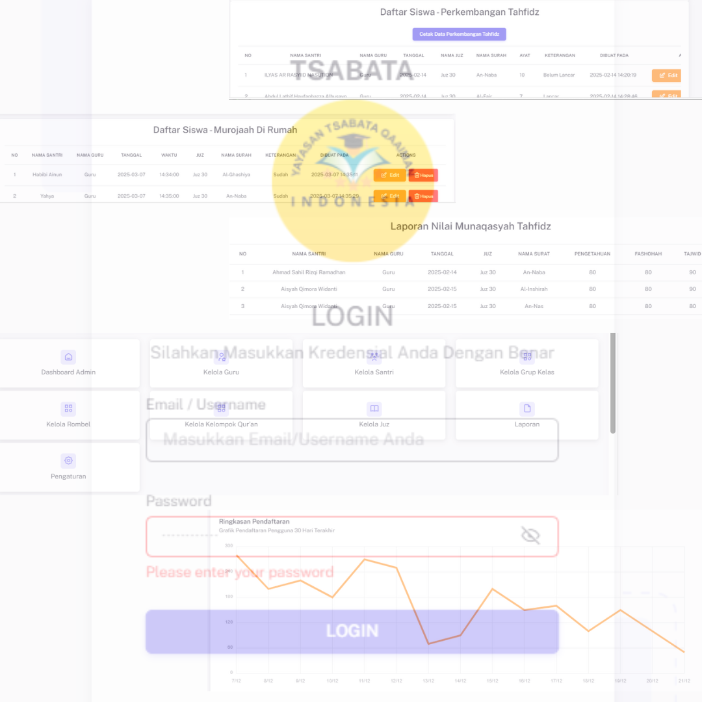

This project is a website designed to manage the developmental scores and munaqasyah of students in the fields of tahfidz, tahsin, murojaah, and tasmi' for students in grades 1-6. The main purpose of this website is to facilitate teachers in conducting assessments as well as increasing the involvement and supervision of santri guardians of their children's educational development.

## Tech Stack

**Frontend Template:** Vuexy

**Backend Framework:** Laravel (PHP)

**Database:** MySQL

**Client-Side Scripting:** HTML, CSS, Javascript

**Version Control:** Git & Github

## Roadmap
- [ ] Responsive and mobile-friendly website
- [ ] Super User (Developer): data management of teachers, guardians, and students
- [ ] Teacher: management of grades and assessment of student development
- [ ] Santri guardian: real-time access to monitor children's grades and progress

## Features

- Accessible anytime and anywhere
- User-friendly interface
- Teacher, student, and guardian data management in one platform
- Weekly and monthly child development reports
- Access rights based on user roles (multi-user role system)
- Export grades to PDF

## Screenshots

#### Login Page
.png)

#### Admin Role
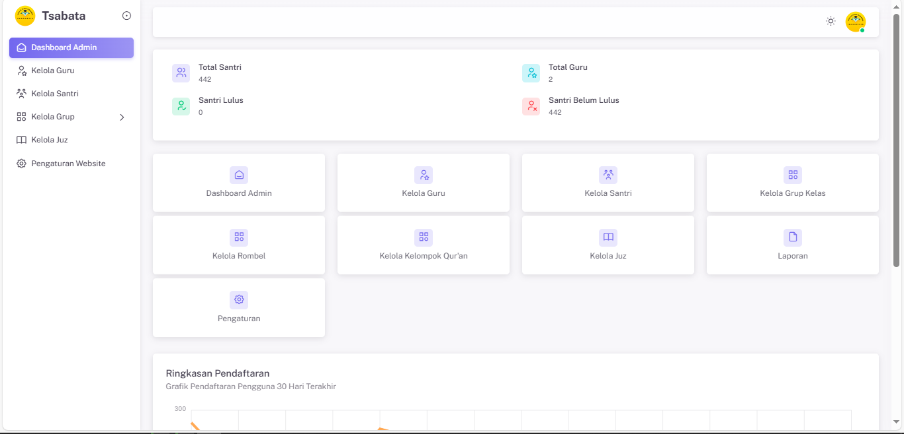
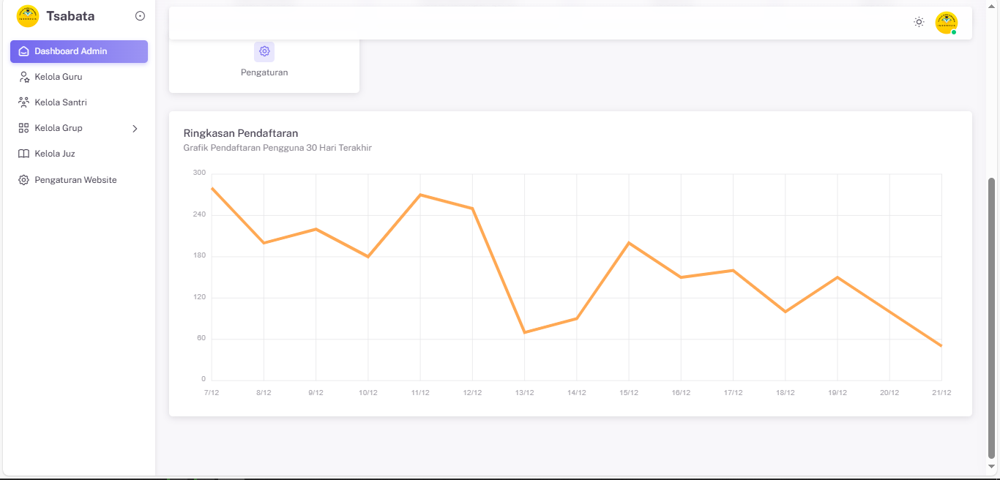

#### Teacher Role
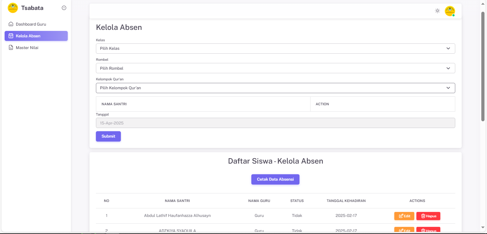
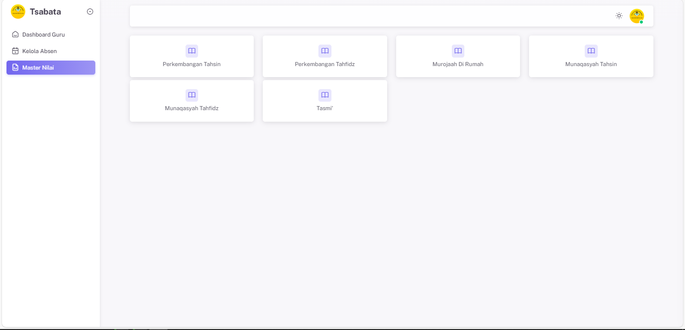
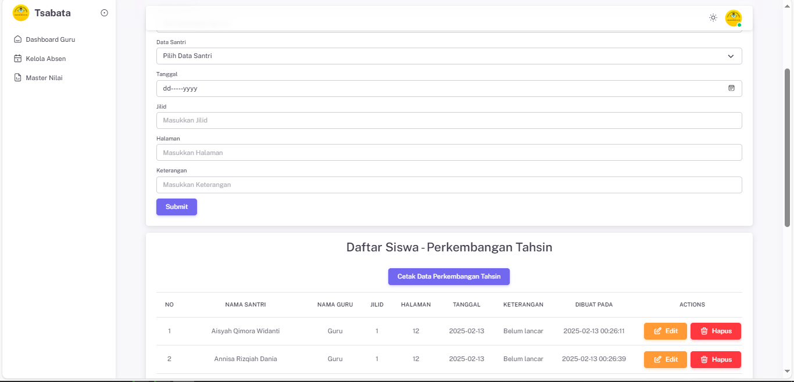
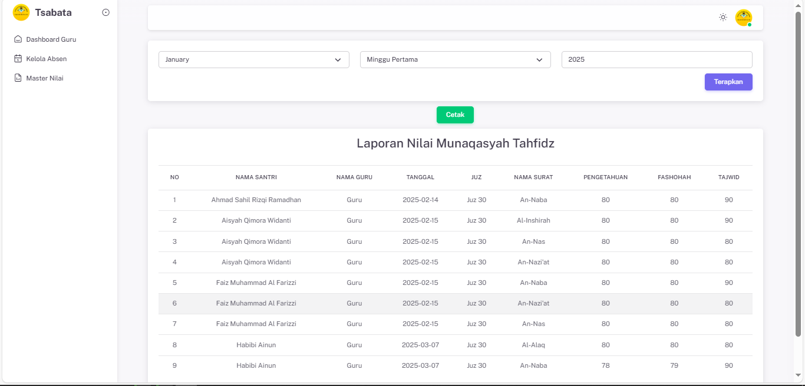
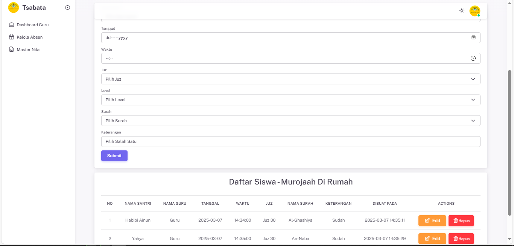

#### Student Guardian
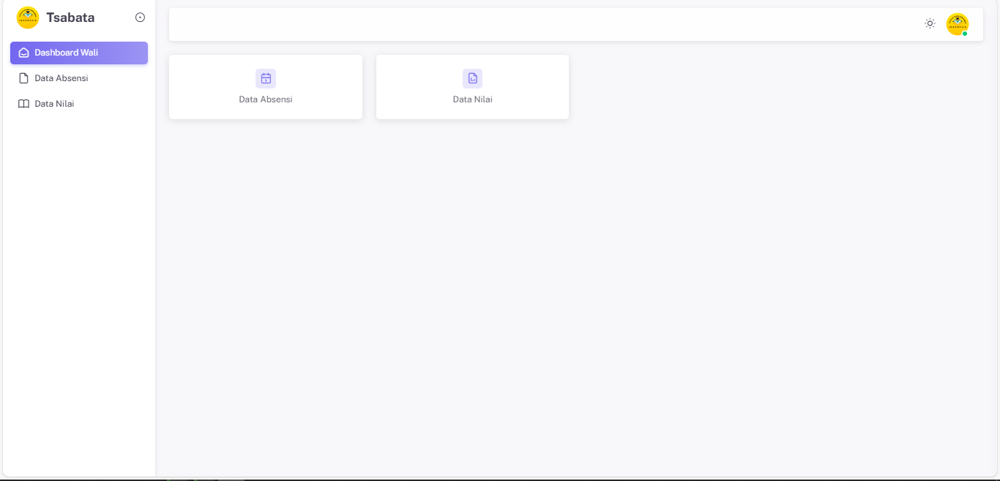
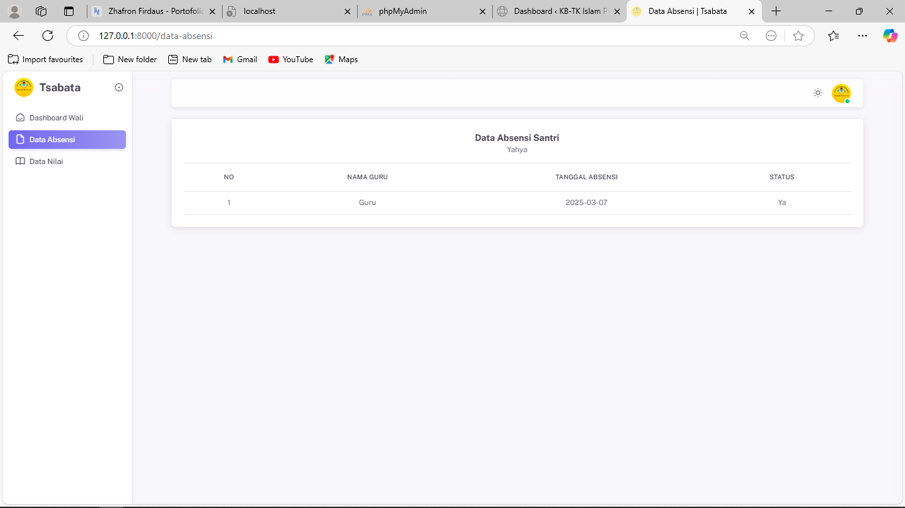
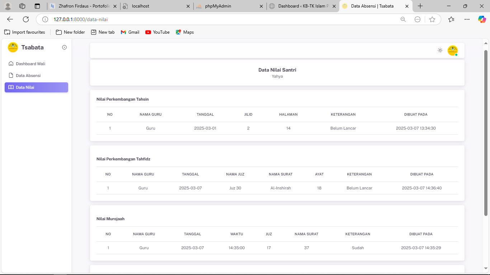

## Support

For support, email zhofronfirdaus@gmail.com

